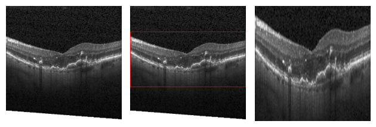

# Object Detection and Image Resizing

This notebook is designed to assist in finding regions of interest in thousands of OCT images and automatically resizing them. It was developed as part of my bachelor thesis, where I trained a GAN to analyze the latent space. It was created with great inspiration from the Kaggle user <a href="https://www.kaggle.com/havinath">Bingi</a> for an image segmentation Kaggle-challenge, where it even helped me securing first place. Check out the original notebook <a href="https://www.kaggle.com/code/havinath/object-detection-using-pytorch-training" target="_blank">here</a>.

## Prerequisites

- A `.json` file in COCO format containing the bounding box labels for the training images.
- A folder containing the training images.
- A folder containing the test images.

## Getting Started

1. Clone this repository to your local machine.
2. Install the required dependencies.
3. Launch the notebook.

## Usage

1. Run the notebook and provide the necessary inputs as prompted.
2. The notebook will automatically download the required model.
3. The training process will create a training dataframe and datasets, incorporating simple augmentations for training the Faster RCNN network.
4. Once your network is trained, you can visualize the resulting bounding boxes alongside the original images.
5. The notebook also provides functionality to automatically resize the resulting bounding boxes.

## Resources

For more information about the COCO format, refer to <a href="https://www.neuralception.com/cocodatasetapi/" target="_blank">this</a> guide.

Feel free to explore and adapt the notebook according to your specific requirements.

